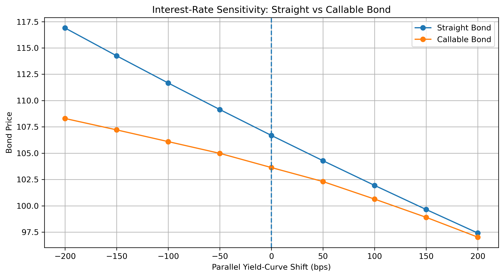
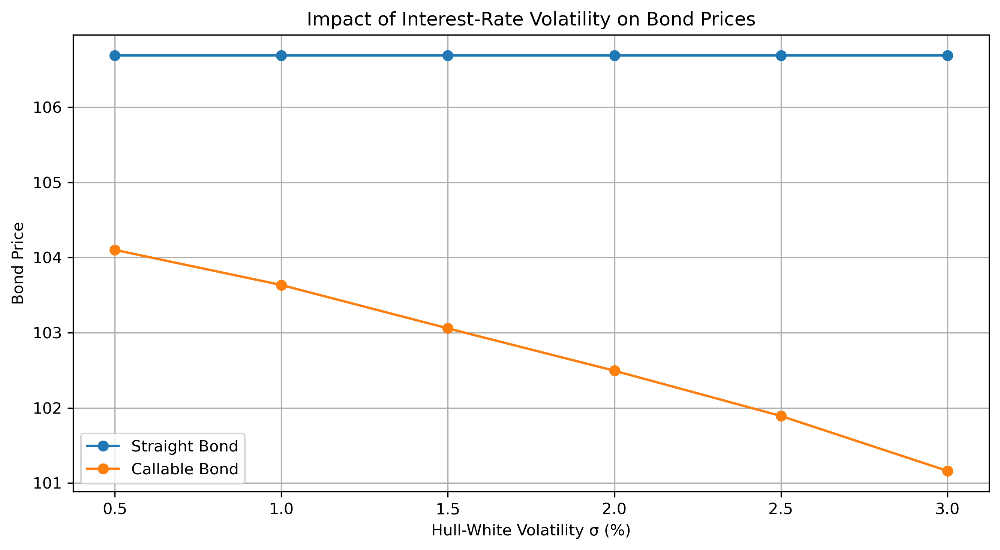

# Callable Bond Pricing & Risk Management

A Python project for pricing and analyzing the interest-rate risk of a callable fixed-rate bond using a one-factor Hull–White model and a calibrated trinomial tree.

The project focuses on the impact of the embedded issuer call option on bond valuation, duration, DV01, convexity, and volatility exposure.

## Project Overview

A callable bond can be interpreted as a straight bond combined with an embedded option sold by the investor to the issuer:

$$
\text{Callable Bond}
=
\text{Straight Bond}
-
\text{Issuer Call Option}
$$

When interest rates decline, the issuer has an incentive to redeem the bond early and refinance at a lower rate. This limits the investor's upside and makes the bond's interest-rate exposure state-dependent.

This project develops a complete framework to model this behavior using a Hull–White short-rate model.

## Bond Structure

The instrument considered is a fixed-rate callable bond with:

- Face value: **100**
- Maturity: **5 years**
- Annual coupon rate: **5%**
- Call protection: **2 years**
- Call dates: **2Y, 3Y and 4Y**
- Call price: **100**
- Call dates coinciding with coupon payment dates

The structure can therefore be described as a **5Y NC2 callable bond**, callable annually at par after the non-call period.

## Methodology

The pricing framework follows five main steps:

1. Construct an illustrative zero-coupon yield curve.
2. Model short-rate dynamics using the one-factor Hull–White model.
3. Build a recombining trinomial interest-rate tree.
4. Calibrate the tree to the initial term structure using Arrow-Debreu state prices.
5. Price the straight and callable bonds by backward induction.

The callable bond value at a call date is determined by:

$$
V_t^{Callable}
=
C_t
+
\min
\left(
V_t^{Continuation},
K
\right)
$$

where \(K\) is the contractual call price.

The issuer exercises the call whenever the continuation value of the bond exceeds the call price.

## Key Results

Under the base-case assumptions:

| Metric | Straight Bond | Callable Bond |
|---|---:|---:|
| Price | 106.68 | 103.63 |
| Effective Duration | 4.56 | 2.59 |
| DV01 | 0.0486 | 0.0268 |
| Effective Convexity | 21.92 | 8.06 |

The value of the embedded issuer call is approximately:

$$
V_{\text{Call}}
=
V_{\text{Straight}}
-
V_{\text{Callable}}
=
3.05
$$

The call feature therefore materially reduces both the value and the interest-rate sensitivity of the bond.

## Interest-Rate Sensitivity



The callable bond exhibits lower sensitivity to declining interest rates than the equivalent straight bond.

As rates fall, the probability of early redemption increases. The expected maturity of the callable bond shortens and its price appreciation becomes progressively constrained by the issuer's call option.

The embedded option therefore creates a state-dependent duration and convexity profile.

## Volatility Sensitivity



Higher short-rate volatility increases the value of the issuer's embedded call option.

In the model, increasing the Hull–White volatility parameter from **0.5% to 3.0%** increases the embedded call value from approximately **2.58 to 5.52**, while the callable bond value decreases from approximately **104.10 to 101.16**.

This follows directly from the investor's position:

$$
\text{Long Callable Bond}
=
\text{Long Straight Bond}
-
\text{Long Issuer Call}
$$

The investor is therefore short the embedded optionality.

## Trading & Risk Management Interpretation

From a trading perspective, a callable bond cannot be managed using only the duration of an equivalent straight bond.

A first-order interest-rate hedge can be constructed using government bonds or interest-rate swaps to offset DV01. However, the hedge is inherently dynamic because the probability of exercise changes as interest rates move.

The position also contains convexity and volatility exposure generated by the embedded call option. Interest-rate options such as swaptions can therefore be used to manage part of this optionality risk.

The overall risk profile can be summarized as:

$$
\text{Interest-Rate Risk}
+
\text{Convexity Risk}
+
\text{Volatility Risk}
$$

## Repository Structure

```text
callable-bond-pricing/
│
├── notebooks/
│   └── callable_bond_pricing.ipynb
│
├── src/
│   ├── hull_white.py
│   └── callable_bond.py
│
├── figures/
│   ├── rate_sensitivity.png
│   └── volatility_sensitivity.png
│
├── README.md
├── requirements.txt
└── .gitignore
```

The full analysis, mathematical derivations, implementation, numerical results, and financial interpretation are available in the Jupyter notebook:

[Open the full notebook](notebooks/callable_bond_pricing.ipynb)

## Model Limitations

This project is designed to capture the main economic mechanisms of callable bond pricing rather than reproduce a production-level pricing library.

The Hull–White mean-reversion and volatility parameters are treated as model inputs rather than calibrated to a market swaption volatility surface.

The framework also abstracts from issuer credit risk, liquidity, transaction costs, funding considerations, detailed day-count conventions, settlement rules, and more complex contractual features.

In a production environment, the initial curve would typically be constructed from liquid market instruments and the model parameters calibrated to market prices or implied volatilities of interest-rate derivatives.

## Technologies

- Python
- NumPy
- Pandas
- SciPy
- Matplotlib
- Jupyter Notebook

## How to Run

Clone the repository and install the required dependencies:

```bash
pip install -r requirements.txt
```

Then open:

```text
notebooks/callable_bond_pricing.ipynb
```

and run the notebook from top to bottom.